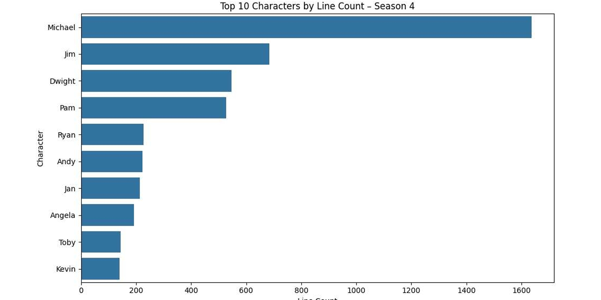
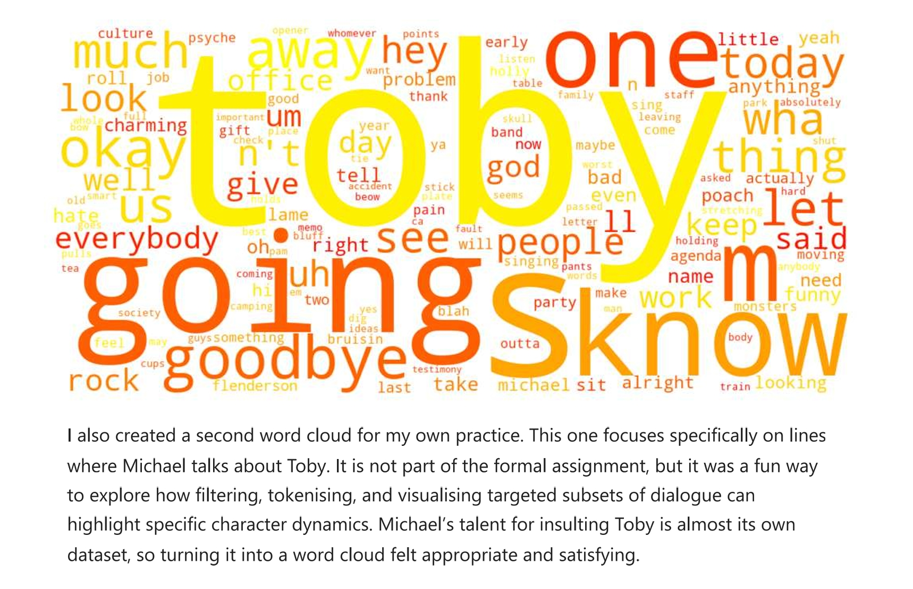

🌟 The Office Season 4 NLP Analysis

A comedic data exploration of sentiment, vocabulary patterns, and Michael Scott’s endless monologues.

  

🎬 Overview

This project applies natural language processing techniques to the Season 4 script of The Office.
It explores who speaks the most, how characters use language, and how the emotional tone of each episode shifts across the season.

It began as a class assignment and became one of my favourite projects of the term because it blends technical analysis with a show that already feels chaotic enough to be a dataset.

📊 Character Line Count

Michael Scott does not only dominate the office.
He dominates the dataset.

  

He speaks significantly more than every other character.
Jim and Dwight follow behind. Pam brings balance.
Toby appears only when absolutely necessary.

🎭 The Toby Word Cloud

I created a separate word cloud using only the lines where Michael talks about Toby.
This was not part of the formal assignment. It was simply fun to visualise one of the most iconic character dynamics in the show.

  

Michael’s feelings about Toby form their own sub-dataset.
Filtering and tokenising these lines was surprisingly satisfying.

🧪 Methods and Techniques

• Text cleaning
• Tokenisation
• Stopword removal
• Lemmatization
• TF-IDF analysis
• Word frequency analysis
• Bigram and trigram extraction
• Sentiment scoring with VADER
• Episode-level sentiment trends
• Emotion classification with transformer models

🔍 Key Insights

• Michael speaks more than all other characters combined
• Dwight uses direct and action-focused language
• Jim’s emotional tone remains stable and predictable
• Pam’s vocabulary is the most balanced
• Sentiment patterns reflect major events in the season
